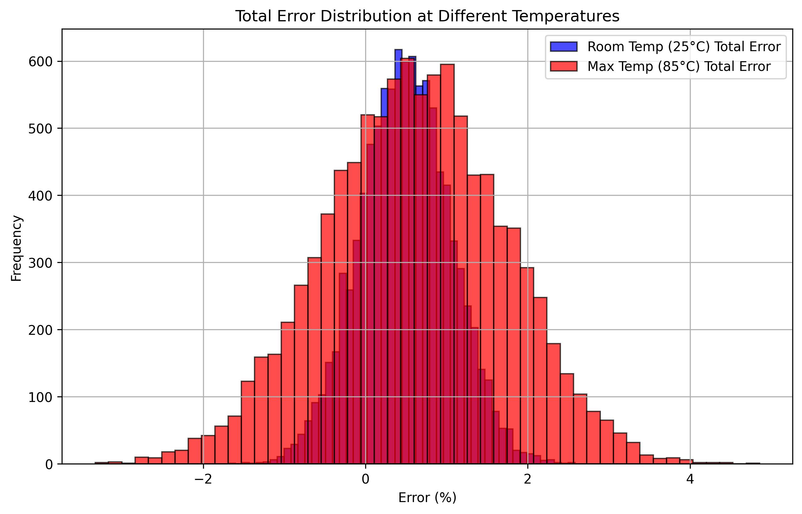

# Component クラス

電子回路の要素（抵抗、コンデンサ、インダクタなど）を表すクラスです。各要素の誤差を計算するために使用されます。

## 機能

- ランダムな誤差の計算
- 温度依存の誤差の計算
- 総合的な誤差の計算
- 誤差分布の可視化

## 使用方法

```python
from scripts.components import Component

# コンポーネントの作成（シード指定可）
resistor = Component(typ_value=1000, random_tolerance=(-2, 3), temp_coefficient=100, sigma=3, seed=42)

# ランダムな誤差の取得
random_error = resistor.get_random_variation()

# 温度依存の誤差の計算 (50℃での誤差)
temp_error = resistor.get_temperature_variation(50)

# 総合的な誤差の計算 (50℃での誤差)
total_error = resistor.get_total_variation(50)

# 誤差分布の可視化 (50℃での分布)
resistor.visualize_error_distribution(50)
```

## API

### `__init__(typ_value, room_temp_tolerance, temp_coefficient, max_temp_tolerance=None, max_operating_temperature=None, sigma=None, seed=None)`

コンポーネントを初期化します。

#### 引数

- `typ_value` (float): 典型値
- `room_temp_tolerance` (float or tuple): 常温におけるランダムな誤差（％）。単一の数値の場合は±その値の範囲、タプルの場合は(min_tolerance, max_tolerance)の範囲。
- `temp_coefficient` (float): 温度係数（ppm/℃）
- `max_temp_tolerance` (float or tuple, optional): 最大動作温度におけるランダムな誤差（％）。指定しない場合はroom_temp_toleranceが使用されます。
- `max_operating_temperature` (float, optional): 最大動作温度（℃）。max_temp_toleranceが指定された場合に必要です。
- `sigma` (float, optional): ランダム誤差の分布のシグマ値。指定しない場合は4.5をデフォルトとします。
- `seed` (int, optional): ランダムジェネレータのシード

### `get_random_variation(temperature)`

ランダムな誤差を取得します。温度に応じて適切なばらつき範囲を使用します。誤差の分布は正規分布に従います。

#### 戻り値

- float: ランダムな誤差（％）

### `get_temperature_variation(temperature)`

温度依存の誤差を計算します。

#### 引数

- `temperature` (float): 現在の温度（℃）

#### 戻り値

- float: 温度依存の誤差（％）

### `get_total_variation(temperature, random_variation=None)`

総合的な誤差を計算します。

#### 引数

- `temperature` (float): 現在の温度（℃）
- `random_variation` (float, optional): ランダムな誤差（％）。指定しない場合はランダムに生成される

#### 戻り値

- float: 総合的な誤差（％）

### `visualize_error_distribution(temperature, sample_size=10000)`

誤差分布を可視化します。

#### 引数

- `temperature` (float): 温度（℃）
#### 引数

- `sample_size` (int): サンプル数（デフォルト: 10000）

---

### 誤差分布の可視化例

以下は、室温（25℃）と最大動作温度（85℃）における総合誤差の分布を重ねて表示した例です。



このグラフは、異なる温度条件下でのコンポーネントの誤差の挙動を視覚的に比較するのに役立ちます。